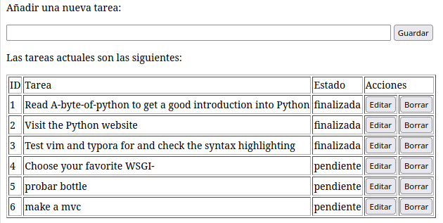

# Introducción a bootle

## Antes de empezar

Este proyecto y su documentación están disponibles en [GitHub](https://github.com/ichigar/bottle-todo)

Puedes clonarlo ejecutando:

```bash
$ git clone https://github.com/ichigar/bottle-todo.git
```

El proyecto se ha desarrollado paso por paso en ramas. Pasándote a la rama de cada lección, podrás ver el código fuente de cada una y la documentación:

```bash
$ git switch lesson1
$ git switch lesson2
...
```

## Lesson1. Empezando con bootle

### Creando el entorno virtual de desarrollo
Para empezar a usar bottle creamos un entorno virtual de desarrollo.

En la carpeta raíz de nuestro proyecto ejecutamos:

```bash
$ python3 -m venv .venv
```

Lo activamos ejecutando:

```bash
$ source .venv/bin/activate
```

El prompt del sistema aparecerá como:

```bash
(.venv) $
```

Esto nos va a permitir empaquetar nuestra aplicación con todas sus dependencias en una carpeta.

### Instalación de bottle

Utilizando el gestor de paquetes de Python, instalamos bottle.
```bash
(.venv) $ pip install bottle       
Collecting bottle
  Using cached bottle-0.12.19-py3-none-any.whl (89 kB)
Installing collected packages: bottle
Successfully installed bottle-0.12.19
```
Para poder usar este proyecto en otro equipo debemos añadir las dependiencias del mismo a un fichero. Lo hacemos ejecutando:

```bash
$ pip freeze > requirements.txt
```
Si copiaramos esta carpeta en otro equipo podríamos instalar las dependencias de este proyecto en el equipo destino. Después de crear el entorno virtual ejecutamos:

```bash
$ pip install -r requirements.txt
```

### Comprobación de funcionamiento

creamos en el raíz del proyecto un fichero `hello.py` con el siguiente contenido:

```python
from bottle import route, run

@route('/hello/<name>')
def index(name):
    return template('<b>Hello {{name}}</b>!', name=name)

run(host='localhost', port=8080)
```
Para combrobar que la aplicación funciona

Ejecutamos el script

```bash
(.venv) $ python hello.py
Bottle v0.12.19 server starting up (using WSGIRefServer())...
Listening on http://localhost:8080/
Hit Ctrl-C to quit.
```

Y a continuación introducimos en el navegador la URL [http://localhost:8080/hello/world](http://localhost:8080/hello/world).

### Creando la base de datos
Empezamos creando la base de datos. Para ello creamos en la subcarpeta `config` un fichero con el nombre `create_database.py` con el siguiente contenido:

```python
import sqlite3
def create_database(db_file):
    conn = sqlite3.connect(db_file) # Warning: This file is created in the current directory
    conn.execute("CREATE TABLE todo (id INTEGER PRIMARY KEY, task char(100) NOT NULL, status bool NOT NULL)")
    conn.execute("INSERT INTO todo (task,status) VALUES ('Read A-byte-of-python to get a good introduction into Python',0)")
    conn.execute("INSERT INTO todo (task,status) VALUES ('Visit the Python website',1)")
    conn.execute("INSERT INTO todo (task,status) VALUES ('Test various editors for and check the syntax highlighting',1)")
    conn.execute("INSERT INTO todo (task,status) VALUES ('Choose your favorite WSGI-Framework',0)")
    conn.commit()
```
Creamos en la carpeta `config`también un fichero `config.py`en el que iremos almacenando los parámetros de configuración de la aplicación. De momento guardaremos el nombre de la base de datas en la variable `DATABASE`:

```python
DATABASE = 'todo.db'
```
Creamos en la carpeta inicial del proyecto un fichero `bootstrap.py` con el siguiente contenido:

```python
from config.create_database import create_database
from config.config import DATABASE

if __name__ == '__main__':
    create_database(DATABASE)
```

Solo se debería ejecutar una vez y es el encargado de crear la base de datos e insertar en la misma los datos iniciales.

lo ejecutamos:

```bash
(.venv) $ python bootstrap.py
```

el fichero `hello.py` ya no lo necesitamos, así que lo podemos eliminar:

```bash
(.venv) $ rm hello.py
```

La estructura actual de nuestro proyecto debería ser:

```bash
(.venv) $ tree             
.
├── bootstrap.py
├── config
│   ├── config.py
│   └── create_database.py
└── README.md
```

### Configuración de la aplicación

Nuestra aplicación será una aplicación web que nos permita gestionar una lista de tareas.

El ejecutable de entrada a la misma será `main.py`. Empezaremos con el siguiente contenido para el mismo:

```python
import sqlite3
from bottle import route, run

'

@route('/todo')
def todo_list():
    conn = sqlite3.connect(DATABASE)
    c = conn.cursor()
    c.execute("SELECT id, task FROM todo WHERE status LIKE '1'")
    result = c.fetchall()
    return str(result)

if __name__ == '__main__':
    run(host='localhost', port=8080, debug=True, reloader=True)
```

* `@route` es un decorador que nos permite definir una ruta para una función.
* `/todo` es la ruta que se va a usar para acceder a la lista de tareas.
* `def todo_list()` es la función que se va a ejecutar cuando se accede a la ruta.
* `debug=True` es un parámetro que nos permite activar el modo depuración. Se mostrará información extra cuando se produzca un error.
* `reloader=True` es un parámetro que nos permite activar el modo de recarga. Se actualizará la página cuando se produzca un cambio en el código. Esto nos evita tener que interrumpir el servidor y volver a ejecutarlo cada vez que hagamos un cambio en el código.

Para comprobar el funcionamiento de la aplicación solo necesitamos ejecutar el script

```bash
(.venv) $ python main.py
```

Y en el navegador accederemos a la URL [http://localhost:8080/todo](http://localhost:8080/todo).

Con ello obtenemos el resultado de ejecutar la función `todo_list()`. Podemos vincular más rutas a una misma función, para ello simplemente añadimos decoradores antes de la misma:

```python
@route('/todo')
@route('/my_todo_list')
def todo_list():
    ...
```
Si en el navegador accederemos a la URL [http://localhost:8080/my_todo_list](http://localhost:8080/my_todo_list) obtenemos el mismo resultado

## Lesson3. Dando formato con plantillas

### Las plantillas

Las plantillas permiten dar formato en HTML a los datos que nos devuelven las funciones.

Bottle incluye su propio motor de plantillas:
* Las plantillas se almacenan en archivos separados con la extensión `.tpl`. 
* Las plantillas pueden ser llamadas desde las funciones que devuelven los datos.
* Las plantillas pueden incluir texto y código en Python que se ejecutará cuando se llame a la plantilla. 
* A la plantilla se le pueden pasar parámetros, como por ejemplo el resultado de una consulta a una base de datos, que luego podrán ser formateados y presentar en la página.

### Mostrando resultados

Para que el resultado de una consulta sea presentado por una plantilla se utiliza la función `template()`. 

A la función se le pasa el nombre de la plantilla y un diccionario con los parámetros que se le pasarán a la plantilla:

```python
from bottle import route, run, debug, template
...
result = c.fetchall()
c.close()
output = template('make_table', rows=result)
return output
...
```
Importamos `template` para poder utilizarla y le pasamos como primer parámetro el nombre de la plantilla y como segundo parámetro el resultado de la consulta que se le pasará a la plantilla en la variable `rows`.

El nombre del fichero de la plantilla debe ser `make_table.tpl` y debe estar en la misma carpeta que la aplicación o en la subcarpta `views`

Creamos la subcarpeta `views` y dentro de ella creamos el fichero `make_table.tpl` con el siguiente contenido:

```html
%#template to generate a HTML table from a list of tuples (or list of lists, or tuple of tuples or ...)
<p>Las tareas pendientes son las siguientes:</p>
<table border="1">
%for row in rows:
  <tr>
  %for col in row:
    <td>{{col}}</td>
  %end
  </tr>
%end
</table>
```

El motor de plantillas se encarga de interpretar en Python las líneas que empiezan por `%`

### Recibiendo datos de entrada

Las plantillas las usaremos también para recoger información de los usuarios.

Vamos a crear una plantilla que será un formulario para añadir una nueva tarea. Dentro de la carpeta `views` crearemos el fichero `new_task.tpl` con el siguiente contenido:

```html
<p>Añadir una nueva tarea a la lista:</p>
<form action="/new" method="POST">
  <input type="text" size="100" maxlength="100" name="task">
  <input type="submit" name="save" value="save">
</form>
```

En el atributo `action` de `form` indicamos que la ruta que ha de procesar los datos recibidos por el formulario es `/new` y en el atributo `method` indicamos que se trata de un formulario de tipo `POST`.

El formulario contiene un campo de entrada de texto que almacena en la variable `task` el texto que el usuario introduce en el campo de entrada y un botón que al pulsarlo envía los datos al servidor y le pasa en la variable `save` el valor `save`.

Para mostrar el formulario añadimos la ruta correspondiente al programa y la función que se debe ejecutar.:

```python
@route('/new')
def new_item_form():
    return template('new_task')
```

Con esto conseguimos que al acceder a la URL [http://localhost:8080/new](http://localhost:8080/new) se muestre el formulario.

Tenemos que añadir una nueva ruta para procesar los datos recibidos por el formulario. En el formulario hemos especificado en el atributo `action` la ruta `/new` para procesaar los datos y en el atributo `method` indicamos que se trata de un formulario de tipo `POST`.

Por defecto las rutas de Bottle son `GET` y para indicar que se trata de un formulario de tipo `POST` se le pasa al decorador de la ruta el parámetro `method='POST'`.

```python
@route('/new', method='POST')
...
```

Dentro de la función encargada de procesar los datos recibidos estos han de poder recogerse. Bottle se encarga de hacer esto en el objeto `request` que para poder utilizarlo hemos de importar:

```python
from bottle import route, run, template, request
```

La función que procesa el formulario quedaría de la forma:


```python
@route('/new', method='POST')
def new_item_save():
    if request.POST.save:  # the user clicked the `save` button
        new = request.POST.task.strip()    # get the task from the form
        conn = sqlite3.connect('todo.db')
        c = conn.cursor()

        c.execute("INSERT INTO todo (task,status) VALUES (?,?)", (new,1))
        new_id = c.lastrowid

        conn.commit()
        c.close()
        # se muestra el resultado de la operación
        return '<p>The new task was inserted into the database, the ID is %s</p>' % new_id
```

* `request.POST` es un diccionario que contiene los datos recibidos por el formulario.
  * `request.POST.save` es una cadena que contiene el valor `save` que se ha introducido en el botón de envío.
  * `request.POST.task` es una cadena que contiene el texto que el usuario ha introducido en el campo de entrada.

### Los decoradores @get y @post

Bottle incluye los decoradores @get y @post para indicar que se trata de una ruta de tipo `GET` o `POST` respectivamente. Podemos sustituir:

```python 
@route('/new)
...
@route('/new', method='POST')
...
```
Por:

```python
@get('/new')
...
@post('/new')
```

Para poder usarlos debemos importarlos:

```python
from bottle import route, run, template, request, get, post
```

### Redireccionando a otra página

En la parte del código anterior en la que procesábamos el formulario al finalizar se devuelve una plantilla con un resumen de la operación realizada. En este caso podríamos tambien querer que se muestre la página con todas las tareas. Para ello tendríamos que redireccionar la página a la ruta `/todo`. Lo podemos hacer utilizando la función `redirect` de Bottle que previamente debemos importar:

```python
...
from bottle import route, run, template, request, get, post, redirect
...
@post('/new')
def new_item_save():
    if request.POST.save:  # the user clicked the `save` button
        ...
        # se redirecciona a la página `/todo`
        return redirect('/todo')
...
```

## Lesson 4. Editando y borrando

Hemos visto las operaciones de listar y añadir. Otra de las operaciones típicas a realizar es editar. Vamos a añadir a nuestra aplicación la posibilidad de modificar una de las tareas ya insertadas en la base de datos.

### Editando

Empezamos creando una ruta para mostrar el formulario de edición. Añadimos a `main.py`:

```python
...
@get('/edit/<no:int>')
def edit_item(no):
    conn = sqlite3.connect('todo.db')
    c = conn.cursor()
    c.execute("SELECT task FROM todo WHERE id = ?", (no,))
    cur_data = c.fetchone()
    return template('edit_task', old=cur_data, no=no)
...
```

En la ruta pasaremos la operación y, como parámetro, el número de la tarea que queremos editar.

```python
<no:int>
```

* '<...>' : indica que esa parte de la ruta será un parámetro.
* ':int' : indica que ese parámetro es un número de tipo entero.
* 'no' : es el nombre del parámetro.

La función obtendrá los datos actuales de la tarea que queremos editar y se los pasará a la plantilla junto con el número de la tarea.

Necesitaremos una plantilla que se encargue de mostrar el formulario de edición de una tarea. Para ello crearemos un fichero `edit_task.tpl` con el siguiente contenido:

```html
<!DOCTYPE html>
<html lang="en">
<head>
    <meta charset="UTF-8">
    <meta http-equiv="X-UA-Compatible" content="IE=edge">
    <meta name="viewport" content="width=device-width, initial-scale=1.0">
    <title>Editar Tarea</title>
</head>
<body>
    <p>Editar la tarea número = {{no}}</p>
    <form action="/edit/{{no}}" method="POST">
      <input type="text" name="task" value="{{old[0]}}" size="100" maxlength="100">
      <select name="status">
        <option>open</option>
        <option>closed</option>
      </select>
      <br>
      <input type="submit" name="save" value="save">
    </form>   
</body>
</html>
```

Para comprobar que se muestra correctamente podemos acceder a la dirección `http://localhost:8080/edit/1` y ver que se muestra el formulario de edición para la tarea número 1.

Para procesar el formulario creamos una ruta `@post` que se encargará de almacenar en la base de datos los cambios realizados en la tarea.

```python
...
@post('/edit/<no:int>')
def edit_item(no):

    if request.POST.save:
        edit = request.POST.task.strip()
        status = request.POST.status.strip()

        if status == 'pendiente':
            status = 1
        else:
            status = 0

        conn = sqlite3.connect(DATABASE)
        c = conn.cursor()
        c.execute("UPDATE todo SET task = ?, status = ? WHERE id LIKE ?", (edit, status, no))
        conn.commit()

        return redirect('/todo')
```

### Actividad 4.1.

Con los pasos anteriores el formulario el nombre de la tarea tal y cómo está guardadad en la base de datos, pero el estado que muestra no es el almacenado en la base de datos. Haz las modificaciones necesarias para que el estado se muestre correctamente.

Puedes ver una posible solución en la rama `actividad-4-1`.

```bash
$ git switch actividad-4.1
```

### Eliminado una tarea

Creamos una ruta para mostrar un formulario de confirmación de eliminación de una tarea. Añadimos a `main.py`:

```python
@get('/delete/<no:int>')
def delete_item(no):
    conn = sqlite3.connect('todo.db')
    c = conn.cursor()
    c.execute("SELECT task FROM todo WHERE id LIKE ?", (str(no),))
    cur_data = c.fetchone()

    return template('delete_task', old=cur_data, no=no)
```

Le pasamos a la plantilla el nombre de la tarea para que se muestre en el formulario de confirmación.

La plantilla (`views/delete_task.tpl`) será la siguiente:

```html
<!DOCTYPE html>
<html lang="en">
<head>
    <meta charset="UTF-8">
    <meta http-equiv="X-UA-Compatible" content="IE=edge">
    <meta name="viewport" content="width=device-width, initial-scale=1.0">
    <title>Borrar tarea</title>
</head>
<body>
    <p>Borrar tarea con ID = {{no}}</p>
    <form action="/delete/{{no}}" method="POST">
      <p>Hac click para confirmar que deseas eliminar la tarea: </p>
      <p><b>{{old[0]}}</b></p>
      
      <input type="submit" name="delete" value="Borrar">
      <input type="submit" name="cancel" value="Cancelar">
    </form>   
</body>
</html>
```

Para procesar el formulario creamos una ruta `@post` que se encargará de eliminar la tarea en caso de haber confirmado la eliminación.

```python
@post('/delete/<no:int>')
def delete_item(no):
    if request.POST.delete:
        conn = sqlite3.connect(DATABASE)
        c = conn.cursor()
        c.execute("DELETE FROM todo WHERE id LIKE ?", str(no))
        conn.commit()
        c.close()

    return redirect('/todo')
```
### Actividad 4.2.

Poniéndolo todo junto. Crea una ruta `@get('/') que será el punto de entrada a la aplicación.

En dicha página se mostrará al principio un formulario para añadir una nueva tarea y a continuación, una tabla con la información de todas las tareas:
* En la primera columna se mostrará el número de la tarea.
* En la segunda columna se mostrará el nombre de la tarea.
* En la tercera columna se mostrará el estado de la tarea (`pendiente` o `finalizada`).
* En la cuarta columna se mostrará un botón para editar la tarea. Al hacer click en él se redirigirá a la página de edición de la tarea.
* En la quinta columna se mostrará un botón para borrar la tarea. Al hacer click en él se redirigirá a la página de confirmación de borrado de la tarea.

Debería tener una apariencia similar a:



Puedes ver una posible solución en la rama `actividad-4-2`.

```bash
$ git switch actividad-4.2
```

## Lesson5. Mostrando contenido estático

Hasta ahora hemos creado rutas para mostrar páginas dinámicas, pero nuestra web también contendrá contenido estático como una página de bienvenida o una página de error; imágenes, CSS, etc.

Igual que con el contenido dinámico, cuando queremos acceder directamente o desde las plantillas a contenido estático **Bottle** ha de saber como acceder al mismo.

Paraestructurar mejor nuestro código podemos crear la carpeta `static` y usarla como base para las rutas estáticas. Si creamos endicha carpeta un archivo `about.html` con el siguiente contenido:

```html
<!DOCTYPE html>
<html lang="en">
<head>
    <meta charset="UTF-8">
    <meta http-equiv="X-UA-Compatible" content="IE=edge">
    <meta name="viewport" content="width=device-width, initial-scale=1.0">
    <link rel="stylesheet" href="/static/css/miligram.css">
    <title>Acerca de</title>
</head>
<body>
  <h1>Acerca de</h1>
  <p>Aplicación para gestión de tareas</p>
</body>
</html>

Y queremos acceder al mismo desde la ruta `/about` primero importamos la función `static_file` de la librería `bottle`.

```python
...
from bottle import route, run, template, request, get, post, redirect, static_file
...
```

Y añadimos la siguiente ruta al fichero `main.py`:


```python
@get('/about')
def about():
    return static_file('about.html', root='static')
```

En la que indicamos que al acceder a dicha ruta se llamara a la función `static_file()` cuyo primer parámetro es el nombre del archivo que queremos mostrar y el segundo (`root`) es la ruta de la carpeta donde se encuentra.

Si todo el contenido estático cuelga de la carpeta `static` y queremos que de manera genérica se pudiese acceder a cualquier archivo estático a partir de su ruta  lo podemos hacer añadiendo en `main.py` la siguiente ruta:

```python
...
@get("/static/<filepath:path>")
def html(filepath):
    return static_file(filepath, root = "static")
...

Donde:
* `filepath` es la ruta del nombre del archivo que queremos mostrar.
* `path` lo reconoce Bottle como de tipo ruta a archivo
```

Así, si copiamos en la carpeta `static/img` una imagen de nobre `todo.png` podemos mostrala en la página `about.html` de la siguiente forma:

```html
...
<h1>Acerca de</h1>
<p>Aplicación para gestión de tareas</p>

...
```

Si en la carpeta `static/css` insertamos un archivo con los estilos a aplicar también bottle lo serviría al ser insertado en cualquier página o plantilla.

```html
<head>
    <meta charset="UTF-8">
    <meta http-equiv="X-UA-Compatible" content="IE=edge">
    <meta name="viewport" content="width=device-width, initial-scale=1.0">
    <link rel="stylesheet" href="/static/css/miligram.css">
    <title>Acerca de</title>
</head>
...
```


## Recursos

* [Bottle - Web oficial del proyecto](http://bottlepy.org/)
* [Bottle - Documentación](https://bottlepy.org/docs/dev/index.html)
* [Bottle - TODO app tutorial](https://bottlepy.org/docs/dev/tutorial_app.html)
