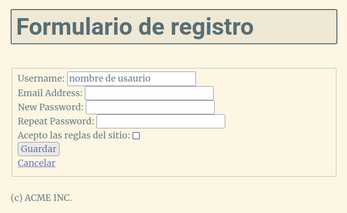
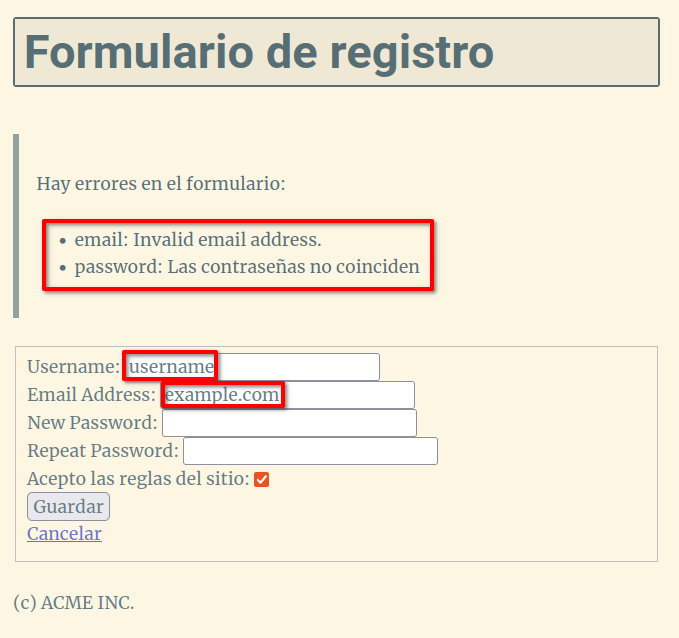

# Introducción a bootle. TODO app.

## Antes de empezar

Este proyecto y su documentación están disponibles en [GitHub](https://github.com/ichigar/bottle-todo)

Puedes clonarlo ejecutando:

```bash
$ git clone https://github.com/ichigar/bottle-todo.git
```

El proyecto se ha desarrollado paso por paso en ramas. Pasándote a la rama de cada lección, podrás ver el código fuente de cada una y la documentación:

```bash
$ cd bottle-todo
$ git switch lesson1
$ git switch lesson2
...
```

## Índice de contenidos

* [Lesson 1. Empezando con bottle](doc/lesson1.md)
* [Lesson 2. Configuración inicial](doc/lesson2.md)
* [Lesson 3. Dando formato con plantillas](doc/lesson3.md)
* [Lesson 4. Editando y borrando](doc/lesson4.md)
* [Lesson 5. Mostrando contenido estático](doc/lesson5.md)
* [Lesson 6. Organizando el código](doc/lesson6.md)
* [Lesson 7. Estructurando las plantillas](doc/lesson7.md)
* [Lesson 8. Desplegando con gunicorn y docker](doc/lesson8.md)
* [Lesson 9. Refactorizando el acceso a la base de datos](doc/lesson9.md)
* [Lesson 10. Generando formularios y validación con WTForms](doc/lesson10.md)

## Lesson 10. Generando formularios y validación con WTForms

La librería **WTForms** simplifica la generación del HTML de los formularios y la validación de los datos de entrada. Está incluida en los frameworks para desarrollo web más populares de Python como Flask y Django. Dada su flexibilidad es bastante sencillo utilizarla también en bottle.

En esta lección veremos como añadir un formulario de registro a nuestra aplicación y como validar los datos de entrada.

### Instalación

Cómo siempre, empezamos creando una rama en nuestro proyecto para la nueva funcionalidad

```bash
$ git switch -c feature/wtforms
```

Para poder utilizar la librería **WTForms**, debemos instalarla. En un terminal con el entorno virtual de nuestro proyecto, ejecutamos:

```bash
$ pip install wtforms
```

También vamos a necesitar la librería `email_validator` para validar el formato de los correos electrónicos.

```bash
$ pip install email_validator
```

Y modificamos `requirements.txt` para que incluya la dependencia:

```python
$ pip freeze > requirements.txt
```

Deberíamos hacer, al menos, un `commit` cada vez que hayamos completado el contenido de uno de los archivos de la rama.

```bash
$ git commit -am "requirements.txt con wtforms y email_validator"
```

## Definiendo un formulario

Empezamos creando en la carpeta raíz del proyecto una carpeta de nombre `forms` y dentro de ella un archivo `register.py`:

```python
from email_validator import EmailNotValidError
from wtforms import Form, BooleanField, StringField, PasswordField, SubmitField , validators

class RegistrationForm(Form):
    
    username = StringField('Username', [validators.Length(min=4, max=25)], default='nombre de usuario')
    email = StringField('Email Address', [validators.InputRequired(), validators.Length(min=6, max=60), validators.Email()])
    accept_rules = BooleanField('Acepto las reglas del sitio', [validators.InputRequired()])
    password = PasswordField('New Password', [
        validators.DataRequired(),
        validators.EqualTo('password_confirm', 
                           message='Las contraseñas no coinciden')
        ])
    password_confirm = PasswordField('Repeat Password')
    save = SubmitField('Guardar')
    cancel = SubmitField('Cancelar')
```

Para cada formulario que queramos añadir a nuestra aplicación creamos una clase que herede de `Form` y que contenga los campos que incluirá el formulario.

Cada campo del formulario se define de la forma:

```python
username = StringField('Username', [validators.Length(min=4, max=25)], default='nombre de usuario')
```

* `username`: Variable que almacenará la información del campo.
* `StringField`: Tipo de campo. En este caso un campo de entrada de texto.
* `Username`: Nombre del campo. Se usará en la etiqueta `label` del campo.
* `[validators.Length(min=4, max=25)]`: Lista de validadores que se aplicarán al campo. En este caso, el campo debe tener entre 4 y 25 caracteres.
* `default='nombre de usuario'`: default nos permite definir un `placeholder` para el campo.

Fíjate que, por ejemplo, para el campo `email` uno de los validadores de la lista es `validators.Email()`. Se encargará de comprobar que el formato del correo electrónico sea correcto. Para poder usar este validador se instaló la librería `email_validator`:

## Usando formularios en las rutas

Para poder utilizar el formulario en la `app` debemos primero importarlo:

```python
from forms.register import RegistrationForm
```

Como en el `PATH` de la aplicación no tenemos la carpeta `forms`, debemos añadir la ruta de la carpeta `forms` a la ruta de la aplicación de la misma forma que añadimos la ruta de la carpeta `models`:

```python
sys.path.append('forms')
```

### Ruta `@get`

El proceso de registró necesitará que usemos 2 rutas. Una por `GET` para mostrar el formulario y otra por `POST` para recibir los datos del formulario y procesarlos.

```python
@get('/register')
def register():
    form = RegistrationForm(request.POST)
    return template('register', form=form)
```

Lo que hacemos es crear un objeto de la clase `RegistrationForm` y se lo pasamos a la plantilla `register.tpl` como parámetro:

Para definir la plantilla creamos el archivo `register.tpl` en la carpeta `views` con el siguiente contenido:

```html
% include('header.tpl', title = "registrarse")
<h1>Formulario de registro</h1>
<form method="POST" action="/register">
    <fieldset>
        <div>
            {{ form.username.label }}:
            {{ form.username }}

        </div>
        <div>
            {{ form.email.label }}:
            {{ form.email }}
        </div>
        <div>
            {{ form.password.label }}:
            {{ form.password }}
        </div>
        <div>
            {{ form.password_confirm.label }}:
            {{ form.password_confirm }}
        </div>
        <div>
            {{ form.accept_rules.label }}:
            {{ form.accept_rules }}
        </div>
        <div>
            {{ form.save }}
        </div>       
    </fieldset>
</form>
% include('footer.tpl')
```

Fíjate que no es necesario de definir el `HTML` de los campos del formulario en la plantilla; `wtforms` ya lo hace por nosotros insertando la etiqueta `label` correspondiente y el campo de entreda en función del objeto utilizado para definirlo.

Si accedemos a `/register` en el navegador nos mostrará el formulario:



Si miramos el código fuente del mismo:

```html
<form method="POST" action="/register">
    <fieldset>
    <div>
        <label for="username">Username</label>:
        <input id="username" maxlength="25" minlength="4" name="username" type="text" value="nombre de usaurio">

    </div>

    <div>
        <label for="email">Email Address</label>:
        <input id="email" maxlength="60" minlength="6" name="email" required type="text" value="">
    </div>

    <div>
        <label for="password">New Password</label>:
        <input id="password" name="password" required type="password" value="">
    </div>
    <div>
        <label for="password_confirm">Repeat Password</label>:
        <input id="password_confirm" name="password_confirm" type="password" value="">
    </div>

    <div>
        <label for="accept_rules">Acepto las reglas del sitio</label>:
        <input id="accept_rules" name="accept_rules" required type="checkbox" value="y">
    </div>

    <div>
        <input id="save" name="save" type="submit" value="Guardar">
        
    </div>
    <div><a href="/" class="btn btn-secondary">Cancelar</a></div>
</fieldset>
</form>
```

Vemos que se ha encargado de generar el formulario de forma automática:
* En el atributo `name` se usa el nombre de la variable que usamos al definir el campo en la clase del formulario
* En el atributo `id` se usa también el nombre de la variable que usamos al definir el campo en la clase del formulario
* En el atributo `type` se usa el tipo de acuerdo a como se definió en la clase del formulario.
* Además ha insertado las validaciones relacionadas con la longitud de los campos. El resto de validaciones tendrán lugar al procesar el formulario.

### Ruta `@post`

Para procesar el formulario debemos definir la ruta `POST`:

```python
@post('/register')
def register_process():
    form = RegistrationForm(request.POST) 
    if form.save.data and form.validate():
        form_data = {
            'username' : form.username.data,
            'email' : form.email.data,
            'password' : form.password.data,
            'accept_rules' : form.accept_rules.data
        }
        print(form_data)
        redirect('/')
    print(form.errors)
    return template('register', form=form)
```

De la misma forma que en la ruta `GET` definimos el objeto `form` de la clase `RegistrationForm` pasándole los datos recibidos del formulario en el objeto `request.POST`.

En el objeto tenemos una propiedad por cada campo del formulario y, a su vez, cada uno tiene un atributo `data` que contiene el valor del campo. Así, por ejemplo, para el campo `username` del formulario podemos acceder al valor recibido por `POST` con `form.username.data`:

El objeto `form` también tiene un atributo `validate()` que nos permite validar los datos del formulario. El método devuelve `True` si los datos del formulario son válidos y `False` en caso contrario.

En este caso, si el formulario es válido simplemente se almacenan los datos recibidos en un diccionario y se por la consola `print(form_data)` y se redirige a la página principal. Aunque lo que tocaría sería guardar los datos en una base de datos.

En caso de no recibirse datos del formulario o que estos no se validen se volverá a mostrar la plantilla de registro pasándole el objeto `form` con los datos actuales del formulario y los mensajes de error.

Los mensajes de error se almacenan en el atributo `errors` del objeto `form` podemos ver la forma en la que se almacenan en la consola `print(form.errors)`.

Si enviamos un formulario con errores se muestra en la consola algo como:

```python
{'email': ['Invalid email address.'], 'password': ['Las contraseñas no coinciden']}
```
Un diccionario en el que la clave es el nombre del campo y el valor es una lista con los mensajes de error.

Modificamos la plantilla `register.tpl` para mostrar los mensajes de error:

```html
% include('header.tpl', title = "registrarse")
<h1>Formulario de registro</h1>
% if form.errors:
<blockquote>
    <p>Hay errores en el formulario:</p>
    <ul>
    % for field, errors in form.errors.items():
        % for error in errors:
        <li>{{field}}: {{error}}</li>
        % end
    % end
    </ul>
</blockquote>

% end
<form method="POST" action="/register">
    <fieldset>
...
```

En caso de haber errores se mostrará un bloque de código HTML con los mensajes de error.

**Nota**: Recuerda que el método `items()` devuelve una lista de pares clave-valor.

```python
>>> errors = {'email': ['Invalid email address.'], 'password': ['Las contraseñas
 no coinciden']}
>>> print(errors.items())
dict_items([('email', ['Invalid email address.']), ('password', ['Las contraseña
s no coinciden'])])
```

En este caso mostramos los mensajes de error al principio de la página en una lista con el nombre del campo y los errores que contiene, pero también los podrías mostrar con cada campo.

Otra cosa que hace `wtforms` por nosotros es poner el valor anterior en el campo del formulario en caso de que el formulario no sea válido.



Salvo, evidentemente, la contraseña que nos obliga a volver a introducirla.

### Mostrando los errores en el campo de entrada

En lugar de mostrar los mensajes de error todos juntos al inicio de la página los podemos mostrar en cada campo del formulario.

Nos podemos ayudar de que no solo se recogen los mensajes de error en `form.errors` sino también para cada campo en `form.campo.errors` en una lista con los errores de cada campo.

Si por ejemplo queremos mostrar los errores de `email` justo a continuación de la entrada del campo de entrada de email:


```html
....
    <div>    
        {{ form.email.label }}:
        {{ form.email }}
        %if form.email.errors:
        <ul class="errors">
            %for error in form.email.errors:
                <li>{{ error }}</li>
            %end
        </ul>
        %end
    </div>
...
```

### Procesando el formulario 
Si introducimos datos correctos se mostrarán los datos en la consola 

```python
{'username': 'username', 'email': 'username@example.com', 'password': '1q2w3e4r', 'accept_rules': True}
```
Y se nos redirigirá a la página principal.

Ya solo te quedaría investigar cómo se generan otros tipos de campos del formulario como listas de selección, checkbox, etc. Y cómo utilizar otro tipo de validaciones.

## Recursos

* [wtforms - WtForms crash course](https://wtforms.readthedocs.io/en/3.0.x/crash_course/)

Espero que no te hayas olvidado de ir haciendo los `commits` correspondientes. Si al final decides quedarte con los cambios debes fusionar la rama con la rama `main` y subir los cambios:

```bash
$ git switch main
$ git merge feature/wtforms
$ git push origin main
```
### Archivos de la lección

Puedes obtener los archivos de la lección ejecutando:

```bash
$ git clone https://github.com/ichigar/bottle-todo.git
$ cd bottle-todo
$ git switch lesson10
```
