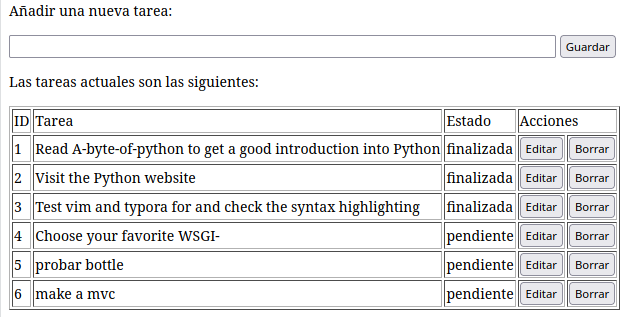

# Introducción a bootle. TODO app.

## Antes de empezar

Este proyecto y su documentación están disponibles en [GitHub](https://github.com/ichigar/bottle-todo)

Puedes clonarlo ejecutando:

```bash
$ git clone https://github.com/ichigar/bottle-todo.git
```

El proyecto se ha desarrollado paso por paso en ramas. Pasándote a la rama de cada lección, podrás ver el código fuente de cada una y la documentación:

```bash
$ cd bottle-todo
$ git switch lesson1
$ git switch lesson2
...
```

## Índice de contenidos

* [Lesson 1. Empezando con bottle](doc/lesson1.md)
* [Lesson 2. Configuración inicial](doc/lesson2.md)
* [Lesson 3. Dando formato con plantillas](doc/lesson3.md)
* [Lesson 4. Editando y borrando](doc/lesson4.md)
* [Lesson 5. Mostrando contenido estático](doc/lesson5.md)
* [Lesson 6. Organizando el código](doc/lesson6.md)
* [Lesson 7. Estructurando las plantillas](doc/lesson7.md)

## Lesson 4. Editando y borrando

Hemos visto las operaciones de listar y añadir. Otra de las operaciones típicas a realizar es editar. Vamos a añadir a nuestra aplicación la posibilidad de modificar una de las tareas ya insertadas en la base de datos.

### Editando

Empezamos creando una ruta para mostrar el formulario de edición. Añadimos a `main.py`:

```python
...
@get('/edit/<no:int>')
def edit_item(no):
    conn = sqlite3.connect('todo.db')
    c = conn.cursor()
    c.execute("SELECT task FROM todo WHERE id = ?", (no,))
    cur_data = c.fetchone()
    return template('edit_task', old=cur_data, no=no)
...
```

En la ruta pasaremos la operación y, como parámetro, el número de la tarea que queremos editar.

```python
<no:int>
```

* '<...>' : indica que esa parte de la ruta será un parámetro.
* ':int' : indica que ese parámetro es un número de tipo entero.
* 'no' : es el nombre del parámetro.

La función obtendrá los datos actuales de la tarea que queremos editar y se los pasará a la plantilla junto con el número de la tarea.

Necesitaremos una plantilla que se encargue de mostrar el formulario de edición de una tarea. Para ello crearemos un fichero `edit_task.tpl` con el siguiente contenido:

```html
<!DOCTYPE html>
<html lang="en">
<head>
    <meta charset="UTF-8">
    <meta http-equiv="X-UA-Compatible" content="IE=edge">
    <meta name="viewport" content="width=device-width, initial-scale=1.0">
    <title>Editar Tarea</title>
</head>
<body>
    <p>Editar la tarea número = {{no}}</p>
    <form action="/edit/{{no}}" method="POST">
      <input type="text" name="task" value="{{old[0]}}" size="100" maxlength="100">
      <select name="status">
        <option>open</option>
        <option>closed</option>
      </select>
      <br>
      <input type="submit" name="save" value="save">
    </form>   
</body>
</html>
```

Para comprobar que se muestra correctamente podemos acceder a la dirección `http://localhost:8080/edit/1` y ver que se muestra el formulario de edición para la tarea número 1.

Para procesar el formulario creamos una ruta `@post` que se encargará de almacenar en la base de datos los cambios realizados en la tarea.

```python
...
@post('/edit/<no:int>')
def edit_item(no):

    if request.POST.save:
        edit = request.POST.task.strip()
        status = request.POST.status.strip()

        if status == 'pendiente':
            status = 1
        else:
            status = 0

        conn = sqlite3.connect(DATABASE)
        c = conn.cursor()
        c.execute("UPDATE todo SET task = ?, status = ? WHERE id LIKE ?", (edit, status, no))
        conn.commit()

        return redirect('/todo')
```

### Actividad 4.1.

Con los pasos anteriores el formulario el nombre de la tarea tal y cómo está guardadad en la base de datos, pero el estado que muestra no es el almacenado en la base de datos. Haz las modificaciones necesarias para que el estado se muestre correctamente.

Puedes ver una posible solución en la rama `actividad-4-1`.

```bash
$ git switch actividad-4.1
```

### Eliminado una tarea

Creamos una ruta para mostrar un formulario de confirmación de eliminación de una tarea. Añadimos a `main.py`:

```python
@get('/delete/<no:int>')
def delete_item(no):
    conn = sqlite3.connect('todo.db')
    c = conn.cursor()
    c.execute("SELECT task FROM todo WHERE id LIKE ?", (str(no),))
    cur_data = c.fetchone()

    return template('delete_task', old=cur_data, no=no)
```

Le pasamos a la plantilla el nombre de la tarea para que se muestre en el formulario de confirmación.

La plantilla (`views/delete_task.tpl`) será la siguiente:

```html
<!DOCTYPE html>
<html lang="en">
<head>
    <meta charset="UTF-8">
    <meta http-equiv="X-UA-Compatible" content="IE=edge">
    <meta name="viewport" content="width=device-width, initial-scale=1.0">
    <title>Borrar tarea</title>
</head>
<body>
    <p>Borrar tarea con ID = {{no}}</p>
    <form action="/delete/{{no}}" method="POST">
      <p>Hac click para confirmar que deseas eliminar la tarea: </p>
      <p><b>{{old[0]}}</b></p>
      
      <input type="submit" name="delete" value="Borrar">
      <input type="submit" name="cancel" value="Cancelar">
    </form>   
</body>
</html>
```

Para procesar el formulario creamos una ruta `@post` que se encargará de eliminar la tarea en caso de haber confirmado la eliminación.

```python
@post('/delete/<no:int>')
def delete_item(no):
    if request.POST.delete:
        conn = sqlite3.connect(DATABASE)
        c = conn.cursor()
        c.execute("DELETE FROM todo WHERE id LIKE ?", str(no))
        conn.commit()
        c.close()

    return redirect('/todo')
```
### Actividad 4.2.

Poniéndolo todo junto. Crea una ruta `@get('/') que será el punto de entrada a la aplicación.

En dicha página se mostrará al principio un formulario para añadir una nueva tarea y a continuación, una tabla con la información de todas las tareas:
* En la primera columna se mostrará el número de la tarea.
* En la segunda columna se mostrará el nombre de la tarea.
* En la tercera columna se mostrará el estado de la tarea (`pendiente` o `finalizada`).
* En la cuarta columna se mostrará un botón para editar la tarea. Al hacer click en él se redirigirá a la página de edición de la tarea.
* En la quinta columna se mostrará un botón para borrar la tarea. Al hacer click en él se redirigirá a la página de confirmación de borrado de la tarea.

Debería tener una apariencia similar a:



Puedes ver una posible solución en la rama `actividad-4-2`.

```bash
$ git switch actividad-4.2
```

### Archivos de la lección

Puedes obtener los archivos de la lección ejecutando:

```bash
$ git clone https://github.com/ichigar/bottle-todo.git
$ cd bottle-todo
$ git switch lesson4
```

El tutorial continua en [lesson5](lesson5.md).